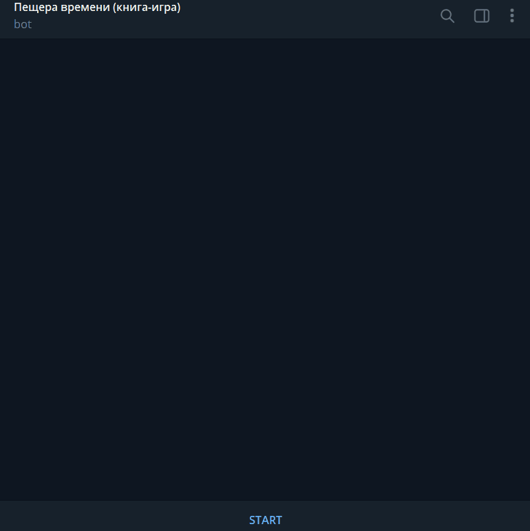
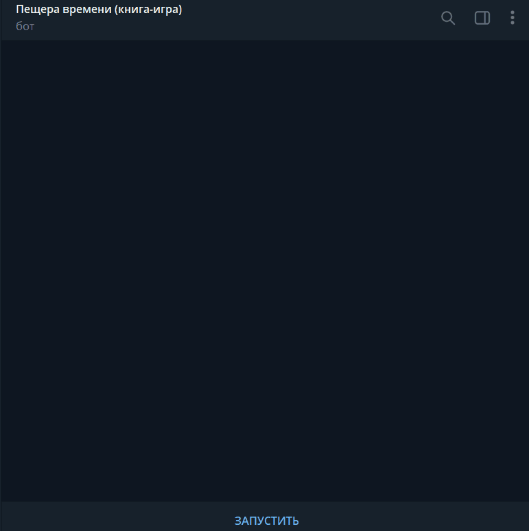

# Game Book | En
developed for convenient reading of gamebooks through a chat bot in a telegram.
There are 3 books in the project:
- **Journey to the bottom of the sea** | R. A. Montgomery | [ru, en]
- **Cave of Time** | Edward Packard | [ru, en]
- **Mystery of the Abandoned Castle** | Edward Packard | [ru, en]

## Launch

#### Variables
**TG_GROUP_TOKEN**  
Chatbot token in Telegram, through which it will be possible to read the game book

**BOOK_NAME**  
The title of the book to be read.

Valid values:  
**PESCHERA_VREMENI**: Cave of Time [rus]  
**PESCHERA_VREMENI_EN**: Cave of Time [eng]  
**TAINA_ZAMKA**: Mystery of the Abandoned Castle [rus]  
**TAINA_ZAMKA_EN**: Mystery of the Abandoned Castle [eng]  
**NA_DNO_MORYA**: Journey to the bottom of the sea [rus]  
**NA_DNO_MORYA_EN**: Journey to the bottom of the sea [eng]

#### Run command
```shell
pip install -r requirements.txt

export TG_GROUP_TOKEN=XXX
export BOOK_NAME=PESCHERA_VREMENI_EN

python main.py
```

**or using Docker**  
```shell
# service_name can be na_dno_morya_en, peschera_vremeni_en, taina_zamka_en, na_dno_morya, peschera_vremeni, taina_zamka
docker-compose up na_dno_morya_en
```
and add **TG_GROUP_TOKEN** variable to .env (see .example.env)

## Example


# Game Book
Данный проект был разработан для удобного прочтения книг-игр через чат-бота в телеграме.
В проекте присуствуют 3 книги:
- **Путешествие на дно моря** | Р. А. Монтгомери | [ru, en]
- **Пещера времени** | Эдвард Паккард | [ru, en]
- **Тайна Заброшенного Замка** | Эдвард Паккард | [ru, en]

## Запуск

#### Переменные
**TG_GROUP_TOKEN**  
Токен чат-бота в Телеграме, через который можно будет читать книгу-игру

**BOOK_NAME**  
Название книги, которую будем читать. 

Допустимые значения:  
**PESCHERA_VREMENI**: Пещера времени [rus]  
**PESCHERA_VREMENI_EN**: Пещера времени [eng]  
**TAINA_ZAMKA**: Тайна Заброшенного Замка [rus]  
**TAINA_ZAMKA_EN**: Тайна Заброшенного Замка [eng]  
**NA_DNO_MORYA**: Путешествие на дно моря [rus]  
**NA_DNO_MORYA_EN**: Путешествие на дно моря [eng]  

#### Команда запуска
```shell
pip install -r requirements.txt

export TG_GROUP_TOKEN=XXX
export BOOK_NAME=PESCHERA_VREMENI

python main.py
```

**или через Docker**
```shell
# service_name может принимать значение na_dno_morya_en, peschera_vremeni_en, taina_zamka_en, na_dno_morya, peschera_vremeni, taina_zamka
docker-compose up na_dno_morya_en
```
и добавьте переменную **TG_GROUP_TOKEN** в .env (см. .example.env)

## Пример работы

