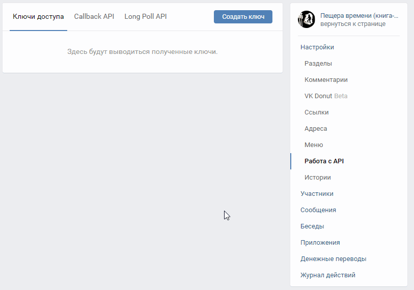
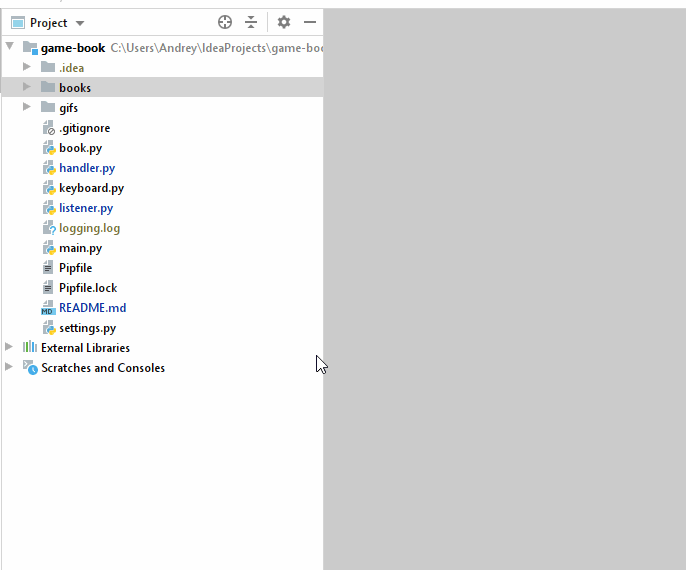
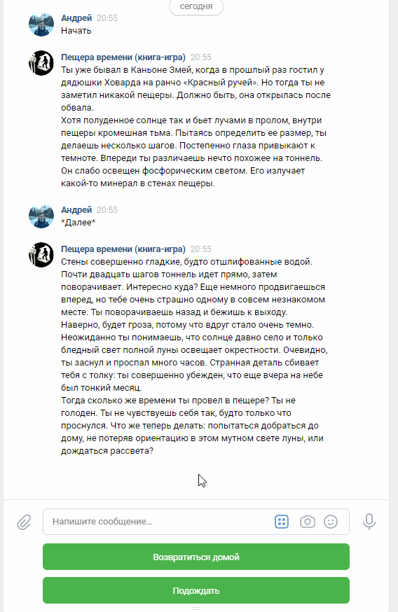
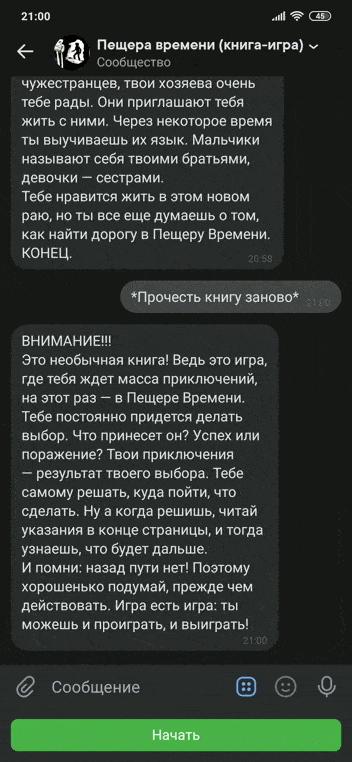

# Game book
Реализация книги-игры через чат-бота группы в ВКонтакте

**Книга**: Пещера Времени  
**Автор**: Эдвард Паккард

## Настройка
### 1. Создать сообщество в ВК
### 2. Сгенерировать токен доступа к API к Вашему сообществу

### 3. Добавить Ваш токен в файл settings.py

### 4. Поздравляю! Ты все сделал правильно!
  
осталось только запустить... 

## Запуск

    pip3 install pipenv
    pipenv install
    pipenv shell
    python main.py

## Геймплей
### На компьютер

### На телефоне
